# Product Catalog MCP Server

## Overview

The **Product Catalog MCP Server** is a .NET 8 web application that implements a Model Context Protocol (MCP) server for managing retail product inventory. It provides a standardized interface for AI assistants and other applications to interact with product data through a set of well-defined tools and APIs.

## What is MCP (Model Context Protocol)?

The Model Context Protocol is a standard that enables AI assistants to securely connect with external data sources and tools. This server acts as a bridge between AI models and product inventory data, allowing natural language interactions with product management operations.

## Architecture

### Technology Stack
- **Framework**: ASP.NET Core 8.0
- **Protocol**: Model Context Protocol (MCP)
- **Data Storage**: JSON file-based storage
- **Language**: C# with nullable reference types enabled

### Core Components

1. **Program.cs** - Application entry point and service configuration
2. **ProductCatalogTools.cs** - MCP tool definitions for product operations
3. **ProductService.cs** - Business logic for product management
4. **Models.cs** - Data models and DTOs
5. **Configuration** - Server configuration settings

### Data Model

Products are represented by the `Product` class with the following properties:

```csharp
public class Product
{
    public string Name { get; set; }           // Product name
    public string Description { get; set; }   // Product description  
    public string EAN { get; set; }          // European Article Number (barcode)
    public decimal Cost { get; set; }        // Product price/cost
    public int UnitsInStock { get; set; }    // Current inventory count
    public string Brand { get; set; }        // Product manufacturer/brand
    public List<string> Categories { get; set; } // Product categories/tags
}
```

## Features & Capabilities

### Core Product Management
- ✅ **Add Products** - Create new products in the inventory
- ✅ **Update Products** - Modify existing product information
- ✅ **Remove Products** - Delete products from the inventory
- ✅ **List Products** - Retrieve all products in the catalog
- ✅ **Search Products** - Find products by name, description, EAN, brand, or categories

### Inventory Management
- ✅ **Stock Tracking** - Monitor units in stock for each product
- ✅ **Stock Updates** - Modify inventory levels
- ✅ **Low Stock Detection** - Identify products with low inventory levels

### Data Persistence
- Products are stored in JSON format in `Data/products.json`
- In-memory operations with file-based initialization
- Thread-safe operations using locking mechanisms

## Available MCP Tools

The server exposes the following tools through the MCP protocol:

| Tool Name | Description | Parameters |
|-----------|-------------|------------|
| `ListProducts` | Returns all products in inventory | None |
| `AddProduct` | Adds a new product | name, description, ean, cost, unitsInStock, brand?, categories? |
| `UpdateProduct` | Updates existing product by EAN | ean + optional fields to update |
| `UpdateStock` | Updates stock quantity | ean, newStock |
| `RemoveProduct` | Removes product by EAN | ean |
| `SearchProducts` | Searches products by term | searchTerm |
| `GetLowStockProducts` | Gets products below threshold | threshold |

### Tool Details

#### ListProducts
Returns the complete list of all products in the inventory.

#### AddProduct
Adds a new product to the inventory. Requires:
- name (string): Product name
- description (string): Product description
- ean (string): EAN barcode
- cost (decimal): Product cost
- unitsInStock (int): Stock quantity
- brand (string, optional): Product brand
- categories (string, optional): Comma-separated categories

#### UpdateProduct
Updates an existing product by EAN. Optional parameters:
- name, description, cost, brand, categories

#### UpdateStock
Updates the stock quantity for a specific product by EAN.

#### RemoveProduct
Removes a product from the inventory by EAN.

#### SearchProducts
Searches for products using a search term that matches against name, description, EAN, brand, or categories.

#### GetLowStockProducts
Returns products with stock levels below a specified threshold (default: 10 units).

## Project Diagrams

### Project Structure

```mermaid
graph TD
    Root[📁 demo-mcp-productcatalog] --> Program[📄 Program.cs]
    Root --> Project[📄 product-catalog-mcp-server.csproj]
    Root --> Build[📄 build.ps1]
    Root --> ReadMe[📄 README.md]
    Root --> AppSettings[📄 appsettings.Development.json]
    
    Root --> Config[📁 Configuration]
    Config --> ConfigFile[📄 ProductCatalogMCPServerConfiguration.cs]
    
    Root --> Data[📁 Data]
    Data --> Products[📄 products.json]
    
    Root --> Services[📁 Services]
    Services --> IService[📄 IProductService.cs]
    Services --> Service[📄 ProductService.cs]
    
    Root --> Tools[📁 Tools]
    Tools --> Models[📄 Models.cs]
    Tools --> MCPTools[📄 ProductCatalogTools.cs]
    
    Root --> Props[📁 Properties]
    Props --> Launch[📄 launchSettings.json]
    
    Root --> Infra[📁 infra]
    Infra --> DeployPS[📄 deploy.ps1]
    Infra --> DeploySH[📄 deploy.sh]
    Infra --> Bicep[📄 main.bicep]
    Infra --> BicepParam[📄 main.bicepparam]
    Infra --> InfraReadMe[📄 README.md]
    
    Root --> Bin[📁 bin]
    Bin --> Debug1[📁 Debug]
    Debug1 --> Net80[📁 net8.0]
    Net80 --> Artifacts[📄 Built artifacts...]
    
    Root --> Obj[📁 obj]
    Obj --> Debug2[📁 Debug]
    Debug2 --> Net80Obj[📁 net8.0]
    Net80Obj --> BuildFiles[📄 Build files...]

    style Root fill:#e1f5fe
    style Program fill:#fff3e0
    style Project fill:#fff3e0
    style Config fill:#f3e5f5
    style Data fill:#e8f5e8
    style Services fill:#fff8e1
    style Tools fill:#fce4ec
    style Props fill:#f1f8e9
    style Infra fill:#e0f2f1
    style Bin fill:#f5f5f5
    style Obj fill:#f5f5f5
```


### Application Architecture


---

## Basic Setup / Running the app Commands

For a quick and simple setup, use these five basic commands:

### 1. Run the dotnet app

From within the application folder in your favorite terminal/console, execute

```bash
dotnet run
```
which starts the application on http://Localhost:47002


### 2. Run the DevTunnel to expose your locally running app to a public URL/Endpoint:

#### 1. log on to DevTunnel

```bash
devtunnel user login
```
**What it does:** Authenticates you with the DevTunnel service using your Microsoft account. This is required before you can create or manage tunnels.

### 2. Create a Tunnel
```bash
devtunnel create product-catalog-mcp -a --host-header unchanged
```
**What it does:** 
- Creates a new tunnel named `product-catalog-mcp`
- `-a` flag makes the tunnel accessible to anyone (anonymous access)
- `--host-header unchanged` preserves the original host header, which is important for applications that depend on specific host values

### 3. Create a Port Mapping
```bash
devtunnel port create product-catalog-mcp -p 47002
```
**What it does:** Creates a port mapping for the `product-catalog-mcp` tunnel, forwarding traffic to local port `47002` where the Product Catalog MCP Server is running.

### 4. Start the Tunnel
```bash
devtunnel host product-catalog-mcp
```
**What it does:** Starts hosting the `product-catalog-mcp` tunnel, making your local application accessible via a public URL. This command will display the public URL that you can use to access your Product Catalog MCP Server from anywhere.

> **Note:** Keep the terminal window with `devtunnel host product-catalog-mcp` open while you need the tunnel active. Make sure your Product Catalog MCP Server is running on port 47002 before starting the tunnel.

# Closing

This MCP server provides a robust foundation for AI-powered product management applications while maintaining simplicity and reliability in its core operations.